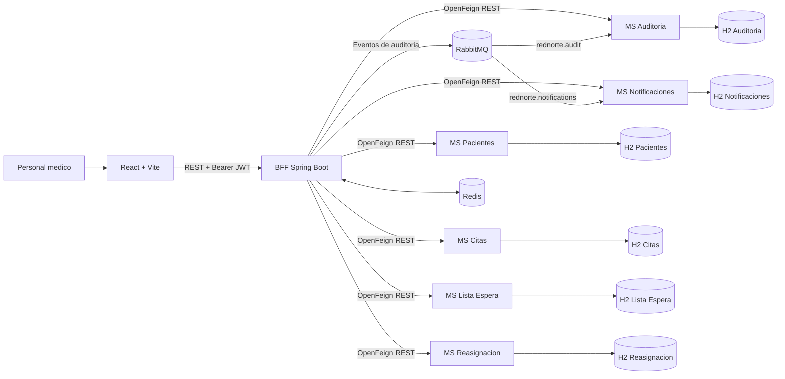
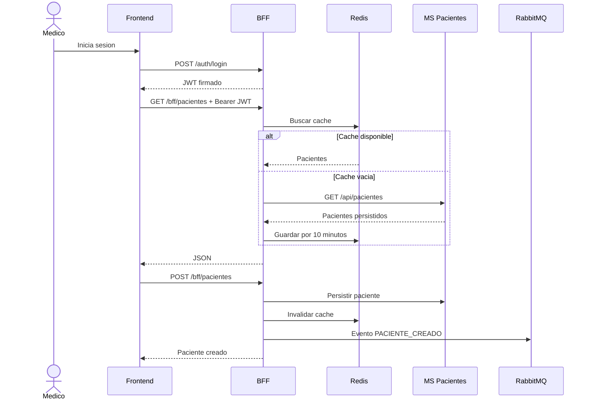

# Arquitectura de microservicios

## Vista de componentes

El frontend solo se comunica con el BFF. Esto evita exponer directamente los
microservicios y centraliza autenticacion, autorizacion, CORS, cache y
auditoria. Cada servicio conserva su propia base de datos para reducir el
acoplamiento.

## Flujo autenticado

## Decisiones

- BFF: contrato unico para React y ocultamiento de topologia interna.
- OpenFeign: clientes REST declarativos entre BFF y microservicios.
- Redis: disminuye lecturas repetidas y se invalida al crear pacientes.
- RabbitMQ: entrega cada evento a las colas independientes de auditoria y
  notificaciones sin bloquear la operacion principal.
- JWT: autenticacion sin sesion de servidor y autorizacion por rol.
- Base de datos por servicio: propiedad y evolucion independiente de datos.
